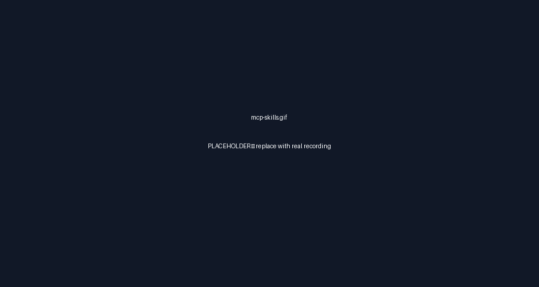

  <picture>
    <source media="(prefers-color-scheme: dark)" srcset="media/logo-dark.svg">
    <source media="(prefers-color-scheme: light)" srcset="media/logo-light.svg">
    
  </picture>

  <h1>Refact</h1>

  
<strong>Refact — the open-source, local-first agentic coding engine.</strong> Autonomous agents, a task planner, persistent project memory, and a cross-device UI — all running from your IDE with zero cloud.

  

  

    
    
    
    
  

Refact is for power users who want an AI development environment they can steer, inspect, and extend: a Rust engine, IDE-native chat, local project state, BYOK providers, MCP integrations, browser automation, task-card agents, and recoverable edits.

## Autonomous agents & tools

Refact's agent loop is built for real development work, not one-shot chat. Sessions move through explicit runtime states such as Idle, Generating, ExecutingTools, Paused, WaitingUserInput, Completed, and Error, so tool use and interruptions stay inspectable.

- Explore code with search, AST, knowledge, and file-reading tools before editing.
- Change the workspace with patch, text-edit, create/update, move, remove, and undo tools.
- Run shells, background processes, services, sleep timers, cron schedules, and delegated subagents.
- Pause for tool confirmation when an action needs user approval instead of silently continuing.

→ Deep dive: [Agent Modes](https://github.com/JegernOUTT/refact/wiki/Agent-Modes), [Agent Tools](https://github.com/JegernOUTT/refact/wiki/Agent-Tools)

## Buddy — proactive project companion

Buddy is Refact's proactive project companion mode. It watches project state, surfaces opportunities, launches investigation chats, drafts editable changes, and can file GitHub issues while staying suggest-first for edits and dangerous commands.

- Daily digest, idle suggester, test-coverage watcher, dependency radar, docs gardener, and architecture-drift watcher workflows help keep a project moving.
- Investigation chats can inspect code and evidence without turning every suggestion into an automatic mutation.
- Drafted changes remain reviewable, and risky actions still go through approval.

→ Deep dive: [Buddy](https://github.com/JegernOUTT/refact/wiki/Buddy)

## Task planner & cards

For bigger work, Refact splits planning from execution. A planner chat breaks the goal into cards, then per-card task-agent chats execute one card at a time in isolated git worktrees.

- Track cards through kanban-style states such as planned, doing, done, failed, and regressed.
- Give each card a focused workspace so unrelated edits do not leak between tasks.
- Use the spawn → verify → merge loop to keep implementation, tests, and review scoped.

→ Deep dive: [Task Planner and Cards](https://github.com/JegernOUTT/refact/wiki/Task-Planner-and-Cards), [Worktrees](https://github.com/JegernOUTT/refact/wiki/Worktrees)

## Persistent project memory

Refact keeps durable project context under `<project>/.refact/` so useful facts survive across chats without requiring a cloud account.

- Hidden static plans use `set_plan`, `update_plan`, and `get_plan` to preserve a stable base plan plus append-only deltas.
- Knowledge graph and VecDB semantic search support project facts, code context, and retrieval.
- @-commands and autoinjection turn selected memory into `context_file` messages when the agent needs it.
- Background indexing, memory tasks, trajectories, integrations, and task metadata all stay project-scoped.

→ Deep dive: [Memory and Knowledge](https://github.com/JegernOUTT/refact/wiki/Memory-and-Knowledge), [Hidden Roles and Plans](https://github.com/JegernOUTT/refact/wiki/Hidden-Roles-and-Plans)

## Local-first & customizable — no cloud

Refact is designed to run from your machine with your project state on disk. There is no bundled Refact cloud or required Refact account for local/BYOK usage.

- Project data lives under `<project>/.refact/`.
- User configuration lives under `~/.config/refact/`; cache, logs, telemetry, and integration state live under `~/.cache/refact/`.
- Modes, tools, prompts, subagents, provider settings, and privacy behavior are configurable.

→ Deep dive: [Privacy](https://github.com/JegernOUTT/refact/wiki/Privacy)

## Modes, transitions, compression & scheduling

Refact exposes distinct modes for different kinds of work: ask, explore, plan, agent, quick_agent, debug, buddy, task-planner, and task-agent.

- `switch_mode` records hidden mode events so transitions stay visible to the runtime without cluttering the transcript.
- Four-stage history compression can remove duplicate context, compress tool results, fix tool-call ordering, and limit history.
- Visible compression reports explain what changed when compaction is applied.
- Basic scheduling tools include `cron_create`, `cron_list`, `cron_delete`, and interruptible `sleep`.

→ Deep dive: [Agent Modes](https://github.com/JegernOUTT/refact/wiki/Agent-Modes), [Context Compression](https://github.com/JegernOUTT/refact/wiki/Context-Compression), [Scheduler and Cron](https://github.com/JegernOUTT/refact/wiki/Scheduler-and-Cron)

## Modern extension surface — MCP, skills, slash commands, hooks, subagents & marketplace

Refact's extension surface is broad but lazy by design: MCP tools can be discovered when needed instead of flooding every model request with every schema.

- MCP integrations support stdio and HTTP/SSE transports, with OAuth-capable integrations where configured.
- Skills, slash commands, hooks, and subagents let teams package repeatable workflows.
- The marketplace organizes Skill, Command, and Subagent extensions for discoverability.

→ Deep dive: [MCP](https://github.com/JegernOUTT/refact/wiki/MCP), [Skills, Commands & Hooks](https://github.com/JegernOUTT/refact/wiki/Skills-Commands-Hooks), [Subagents](https://github.com/JegernOUTT/refact/wiki/Subagents), [Marketplace](https://github.com/JegernOUTT/refact/wiki/Marketplace)

## Bring your own models — multi-provider / BYOK

Use hosted providers, local runtimes, or custom OpenAI-compatible endpoints. Refact resolves model capabilities so the engine can choose appropriate behavior for chat, tools, reasoning, embeddings, and provider-specific surfaces.

- Hosted provider families include Anthropic, OpenAI, OpenRouter, Groq, DeepSeek, Google Gemini, xAI, Qwen, Kimi, Zhipu, MiniMax, and more.
- Local or self-hosted options include Ollama, LM Studio, vLLM, and custom OpenAI-compatible servers.
- BYOK keeps provider credentials and policy under your control.

→ Deep dive: [BYOK](https://github.com/JegernOUTT/refact/wiki/BYOK), [Providers](https://github.com/JegernOUTT/refact/wiki/Providers), [Supported Models](https://github.com/JegernOUTT/refact/wiki/Supported-Models)

## Rust core + cross-device UI

The `refact-lsp` Rust engine serves the HTTP API and streams chat state over SSE independently of IDE plugins. The UI can be opened in any browser that can reach the engine.

- IDE plugins communicate with the engine through LSP and HTTP.
- The React chat UI receives snapshots and streaming events from the local server.
- Browser access is scoped to networks that can reach the engine; it is not a hosted global account surface.

→ Deep dive: [Architecture](https://github.com/JegernOUTT/refact/wiki/Architecture), [GUI Architecture](https://github.com/JegernOUTT/refact/wiki/GUI-Architecture)

**Also included:** [Code Completion (FIM)](https://github.com/JegernOUTT/refact/wiki/Code-Completion-FIM), browser automation through [Chrome integrations](https://github.com/JegernOUTT/refact/wiki/Integrations-Chrome), and [Checkpoints & Git](https://github.com/JegernOUTT/refact/wiki/Checkpoints-and-Git).

## Quickstart & install

1. Install Refact for your IDE:
   - [VS Code](https://github.com/JegernOUTT/refact/wiki/Installation-VS-Code)
   - [JetBrains](https://github.com/JegernOUTT/refact/wiki/Installation-JetBrains)
2. Open a workspace and launch the Refact sidebar or tool window.
3. Configure a provider or local runtime with [BYOK](https://github.com/JegernOUTT/refact/wiki/BYOK).
4. Pick chat, agent, reasoning, and embedding defaults where applicable.
5. Start with the [Quickstart](https://github.com/JegernOUTT/refact/wiki/Quickstart), then explore the full [Installation](https://github.com/JegernOUTT/refact/wiki/Installation) guide.

## Comparison

| Capability | Refact (this fork) | Upstream archive | Typical AI assistant |
| --- | --- | --- | --- |
| Local-first / no-cloud | Local engine, local project state, zero bundled cloud requirement | Earlier local-first foundation, no longer active | Often service-hosted by default |
| BYOK providers | Broad hosted, local, OpenAI-compatible, and custom provider support | Older provider coverage | Usually one vendor or a small provider set |
| Autonomous agents | Tool-using agent modes with shell, file, browser, MCP, and delegation support | Earlier agent workflows | Often chat-first with limited autonomy |
| Task planner + cards | Planner chats, task boards, per-card agents, and worktree isolation | Not the active focus | Usually external project tracking |
| Persistent memory + autoinjection | `.refact/` knowledge, trajectories, tasks, integrations, VecDB, and context injection | Earlier project state concepts | Often ephemeral or account-cloud memory |
| Hidden static plans | `set_plan`, `update_plan`, and `get_plan` preserve base plans plus append-only deltas | Not a primary public surface | Rarely supported |
| MCP / skills / subagents | MCP lazy discovery, skills, slash commands, hooks, subagents, and marketplaces | More limited extension story | Varies by vendor |
| Worktree isolation | Per-card isolated git worktrees for task-agent execution | Not a central workflow | Rarely built in |
| Scheduler / cron | Basic `cron_create`, `cron_list`, `cron_delete`, and `sleep` tick events | Not a central workflow | Usually absent or external |
| Cross-device UI | Browser UI works anywhere that can reach the local engine | Earlier web UI foundation | Usually app-specific |
| Telemetry-free | Local/BYOK usage does not require a Refact cloud account | Cloud-era integrations existed historically | Often account and service telemetry based |

## Supported providers & models

Refact supports provider families including Anthropic, OpenAI, OpenAI Responses, OpenAI Codex, OpenRouter, Ollama, LM Studio, vLLM, Groq, DeepSeek, Doubao, xAI, xAI Responses, Google Gemini, Qwen, Kimi, Zhipu, MiniMax, GitHub Copilot, Claude Code, and custom OpenAI-compatible providers.

Model availability, pricing, quotas, and data policy come from the provider or runtime you configure. See [Supported Models](https://github.com/JegernOUTT/refact/wiki/Supported-Models) and [BYOK](https://github.com/JegernOUTT/refact/wiki/BYOK).

## Contributing & community

Contributions are welcome. Start with [CONTRIBUTING.md](CONTRIBUTING.md), open a focused [Issue](https://github.com/JegernOUTT/refact/issues), or join [Discussions](https://github.com/JegernOUTT/refact/discussions).

Docs live in the [GitHub Wiki](https://github.com/JegernOUTT/refact/wiki), including setup guides, supported models, BYOK configuration, and agent tooling notes.

## License + attribution

Refact is distributed under the BSD-3-Clause license. See [LICENSE](LICENSE) for details.

Refact is the actively maintained fork of the archived [`smallcloudai/refact`](https://github.com/smallcloudai/refact).
